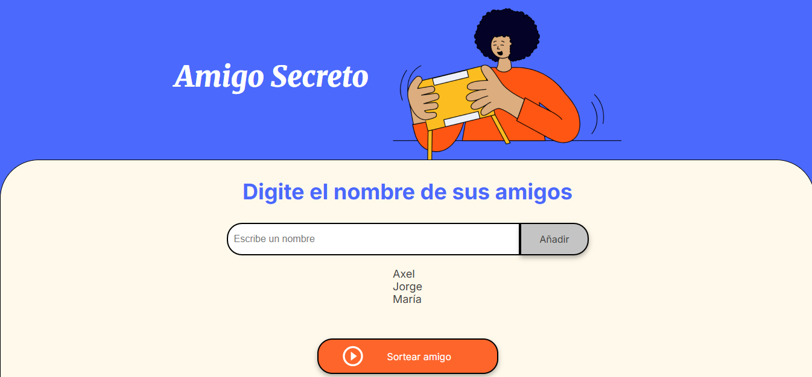
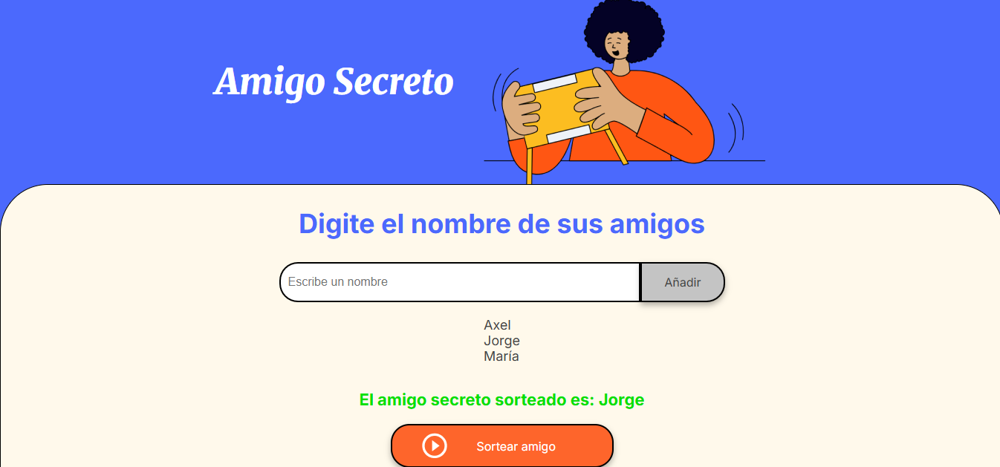

# 🎁Amigo secreto🎉

Aplicación web que permite a los usuarios ingresar una cantidad de nombres de amigos en forma de lista y realizar un sorteo para determinar el amigo secreto.

---

## 🚀Funcionalidades

- ✅Agregar nombres mediante un campo de entrada.
- ⚠️Validación para evitar entradas vacías o duplicadas.
- 📃Visualización dinámica de la lista de amigos ingresado
- 🔄Sorteo aleatorio de un amigo secreto desde los nombres disponibles en la lista.
- 🧼Limpieza automática del campo de entrada después de agregar un nombre.

---

## 🖼️Capturas de pantalla

### 📥Agregar nombres

### 🎲Realizar sorteo

---

## 🛠️¿Cómo usar?

1. Abre el archivo `index.html` en tu navegador.
2. Escribe un nombre en el campo de texto y haz clic en **"Añadir"**.
3. Verás la lista de nombres agregados.
4. Cuando estes listo, haz clic en **"Sortear amigo"** para elegir a uno aleatoriamente.

---

## 🧠Recomendaciones

- Usa nombres reales o apodos, pero evita duplicados ya que el sistema detectará cuando intentes poner un nombre que ya está y no te permitirá agregarlo nuevamente.
- ¡Ideal para juegos de oficina o reuniones familiares!

---

## 👨‍💻Autor

**Axel Edwin Serrano Ruiz**
